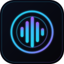

# NEBULA Player



深空黑科技风的 **AI 本地音乐播放器**（Windows · Electron + React + TypeScript）
**当前版本 1.0.6** · [下载安装包](https://github.com/bo-830/nebula-player/releases/latest) · [更新说明](RELEASE-NOTES-v1.0.6.md)

本地曲库扫描与播放（MP3 / WAV / FLAC / AAC / APE / OGG）、四维分类与全局搜索、歌单与收藏、系统托盘与进度记忆、
实时频谱与同步歌词，以及通过你自己的 OpenAI 兼容接口驱动的 AI 音乐助手「**薇拉 Vela**」——
可以直接用自然语言让它播放、切歌、调音量、建歌单，也能聊音乐。
**播放全程离线，只有 AI 对话联网。**

---

## 一、下载安装（普通用户）

1. 打开 [Releases 页面](https://github.com/bo-830/nebula-player/releases/latest)，下载
   **`nebula-player-1.0.6-setup.exe`**（约 113 MB）
2. 双击安装，默认装到 `%LOCALAPPDATA%\Programs\nebula-player`
3. 安装包**未做代码签名**，Windows 会提示"未知发布者"：点 **更多信息 → 仍要运行** 即可
4. 卸载：Windows「设置 → 应用」里卸载 NEBULA Player

**系统要求**：Windows 10 / 11 64 位；无需另装运行库（ffmpeg 已内置）。

**校验下载**：安装包的 SHA-512 记录在同版本 Release 的 `latest.yml` 里，可自行复算比对。

---

## 二、快速上手

### 1. 添加音乐
点主界面左侧的「添加音乐」选择文件夹（也可以直接把文件夹/文件**拖进窗口**）。
扫描完成后即可播放；**新扫描的目录可以立即播放，无需重启**。

### 2. 播放
- 双击列表里的歌曲开始播放；底栏可播放/暂停、上一曲/下一曲、拖拽进度、调音量
- 播放模式：**列表循环 / 单曲循环 / 随机**
- 支持系统媒体键（可在设置里开关），关窗口默认最小化到**系统托盘**（托盘也能控制播放）
- 关闭后再次打开会**从上次位置继续**

### 3. 迷你窗（悬浮歌词条）
点底栏的**迷你窗按钮**打开：

| 状态 | 尺寸 | 内容 |
|---|---|---|
| 收起 | **360×128** | 封面 + 歌名 + 同步歌词 + 播放控制 |
| 展开 | **360×540** | **上方搜索框** + 播放信息/歌词 + **下方 AI 聊天框** |

- 展开后可以直接在迷你窗里**搜索曲库并播放**，也可以**和薇拉对话**（与主窗口是同一个对话）
- 拖动窗口的位置靠**头部区域**；点右上角 × 是隐藏，不是退出
- 窗口始终置顶；每次打开都在收起态，展开不会跑出屏幕（自动贴边裁剪）

### 4. 歌词与偏移校准
把与音频**同名的 `.lrc`** 放在音频旁边，或依赖内嵌歌词。
如果歌词比声音快/慢，用详情页或迷你窗上的 **±0.5 秒** 微调 —— **每首歌各记各的**，下次自动生效。

### 5. 睡眠定时器
底栏的睡眠按钮里可选：**15 / 30 / 60 分钟**、**播完当前歌曲**、**播完当前队列**。

### 6. 接上 AI（可选）
「设置 → AI 配置」填入：

| 字段 | 示例 |
|---|---|
| 接口地址 | `https://api.deepseek.com/v1`（任意 OpenAI 兼容 Chat Completions 端点） |
| API Key | 你的密钥（经系统安全存储加密保存，本地加密落盘） |
| 模型名称 | 如 `deepseek-chat` |

点「测试连接」通过后即可对话。能这么说：
「播放本地的《夜曲》」「暂停」「音量调到 50%」「切随机播放」「创建一个叫『夜跑』的歌单」，
也可以问音乐知识、让它按口味推荐。

> **关于「薇拉 Vela」**：执行类指令只回一句结论；推荐与闲聊时可以卖萌、用 emoji；
> **删除类操作会先弹确认条**并写清"从《歌单名》移除 N 首：A、B、C"，你点确认才真正执行。
> 曲库里没有的歌它会直说没有，并给出最接近的 3 首。

### 7. 自动更新（可选）
「设置 → 通用 → 更新地址」填：
```
https://github.com/bo-830/nebula-player/releases/latest/download/
```
之后每次发布新版本，应用会自动检测并提示更新。

---

## 三、常见问题

| 现象 | 处理 |
|---|---|
| 安装时提示"未知发布者" | 当前版本未做代码签名：更多信息 → 仍要运行 |
| 双击歌曲没声音 | 确认格式受支持；AAC/APE 首次播放会**自动转码**（有缓存），稍等一两秒 |
| 频谱不动 | 部分虚拟声卡/受限音频环境下会自动切换为直连播放（优先保证出声）；换默认输出设备后重启应用 |
| 扫描后提示失败 | 极小概率的时序问题：**重新扫描一次即可**（已列入下一版修复） |
| 系统媒体控件里没有封面 | 已知限制：系统媒体浮窗暂不显示封面，应用内封面正常 |
| AI 报错 | 检查「设置 → AI 配置」的接口地址 / Key / 模型名与网络；本地播放不受影响 |
| 想清空曲库/设置 | 数据都在 `%APPDATA%\nebula-player\`：`library.json`（曲库）、`playlists.json`（歌单）、`chat.json`（对话）、`settings.json`（设置，含加密密钥） |

---

## 四、从源码运行（开发者）

```bash
npm install
npm run dev
```

> 中国大陆网络下安装若遇 GitHub 下载缓慢/失败，先设置镜像再安装：
>
> ```powershell
> $env:ELECTRON_MIRROR="https://cdn.npmmirror.com/binaries/electron/"
> npm install
> node node_modules\electron\install.js
> ```

## 五、打包与发布

```bash
npm run icons      # 从 build/icon.svg 生成图标（可选）
npm run build:win  # Windows NSIS 安装包 → dist/nebula-player-<version>-setup.exe
npm run build:mac  # macOS dmg（需在 macOS 上构建）
```

中国大陆打包镜像（构建期同样被 GitHub 阻断时）：

```powershell
$env:ELECTRON_MIRROR="https://cdn.npmmirror.com/binaries/electron/"
$env:ELECTRON_BUILDER_BINARIES_MIRROR="https://registry.npmmirror.com/-/binary/electron-builder-binaries/"
npm run build:win
```

**云端发布（推荐）**：仓库内置 GitHub Actions 工作流 `.github/workflows/build-win.yml`。
推一个 `v*` 标签就会在云端构建并把 `setup.exe` + `.blockmap` + `latest.yml` 自动挂到 Release：

```bash
git tag v1.0.7 && git push origin v1.0.7
```

## 六、技术要点

- `media://` 自定义协议 + 手动 Range 支持（`src/main/protocol.ts`）→ 任意本地音频可拖拽跳转
- Web Audio 图谱：`<audio>` → AnalyserNode（频谱）→ GainNode（音量平滑）→ 输出
- 主进程持有 LLM 请求与密钥解密；渲染进程仅通过 IPC 桥（`window.api`）交互
- 迷你窗是**独立渲染进程**，只做显示与输入；播放与 AI 工具链仍在主窗口，避免逻辑重复
- 数据全部落在 userData：`library.json` / `playlists.json` / `chat.json` / `settings.json`（密钥加密）
- 零原生依赖（ffmpeg 为独立二进制），`npmRebuild: false`
- 音频健壮性：Web Audio 图谱仅在实际播放时创建；若环境使图谱静默，检测到后自动切换为直连播放

## 七、测试

```bash
npm run typecheck  # TS 严格检查
npm test           # vitest 单元测试（179 项）
npm run lint       # ESLint
```

## 八、目录结构

```
src/main/       主进程：扫描/元数据/转码/LLM 客户端/托盘/协议/IPC
src/preload/    桥接层 window.api
src/renderer/   React UI：stores(zustand) + components + styles
src/shared/     主进程与渲染进程共享类型
scripts/        图标生成、E2E 驱动、Mock LLM 服务器
.devdata/       测试与发布证据（含各轮独立验证/审查报告）
```

## 九、已知边界

- 安装包未做代码签名（首次安装有 SmartScreen 提示）
- APE 仅做分支级验证（本机无 APE 编码器，未做端到端实测）
- 曲库按 ≤2 万首设计（JSON 持久化 + 内存索引）；更大规模建议等后续 SQLite 版本
- macOS 包需在 macOS 上构建（配置已就绪，尚未测试）
- 仅适配系统默认音频输出设备
- 系统媒体控件（SMTC）暂不显示封面
